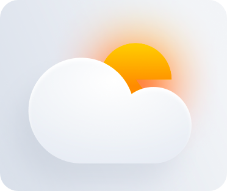
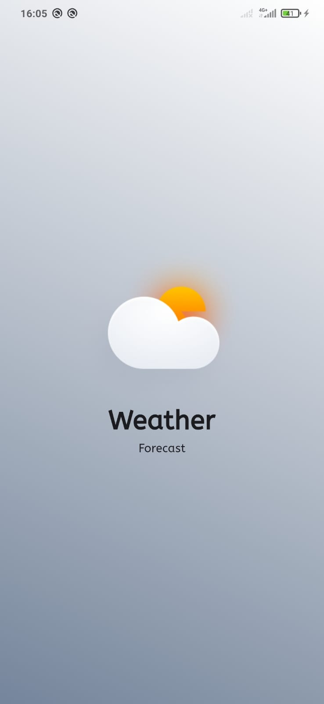
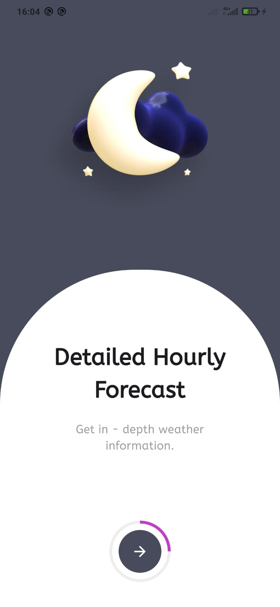
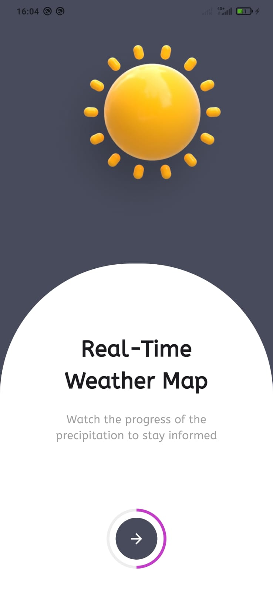
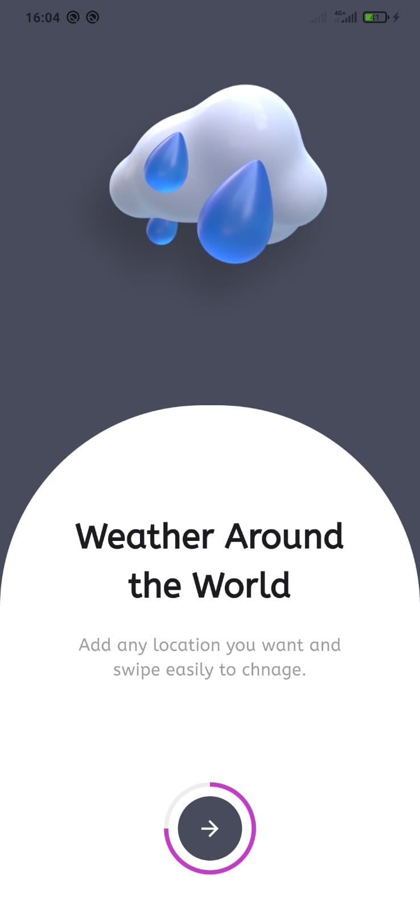
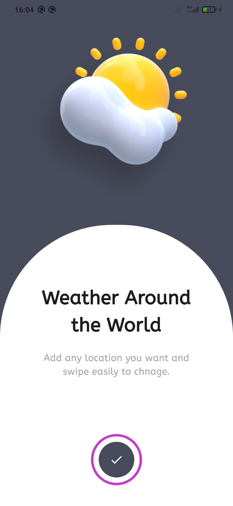

# Weather App
To summarize and brief in short, Weather App is the application of science and technology to predict the conditions of the atmosphere for a given location and time. People have attempted to predict the weather informally for millennia and formally since the 19th century.

## Getting Started
### Dependencies Packages:
* StateManagment - Provider
* Location - Geolocator
* Network - Dio
* Local Storage - Shared Preferences
* Animation - Lottie
* Date - initl

### Design 
* Figma - (https://www.figma.com/community/file/1019501826717499483/weather-app-design?searchSessionId=ls7g7tae-chqwxsbl1cc) follow the link.
  
## UI/UX 
### App Icon

### Splash Page

### Onboarding Pages

  

    
    
    
    
    
     
  

